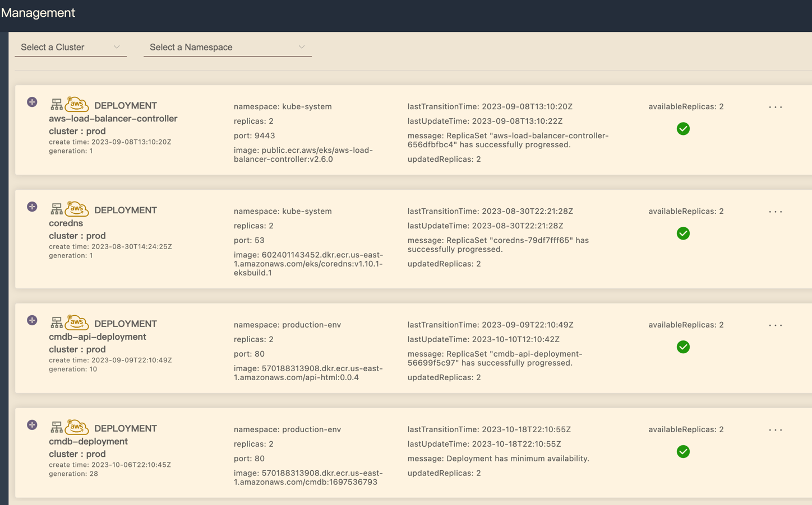
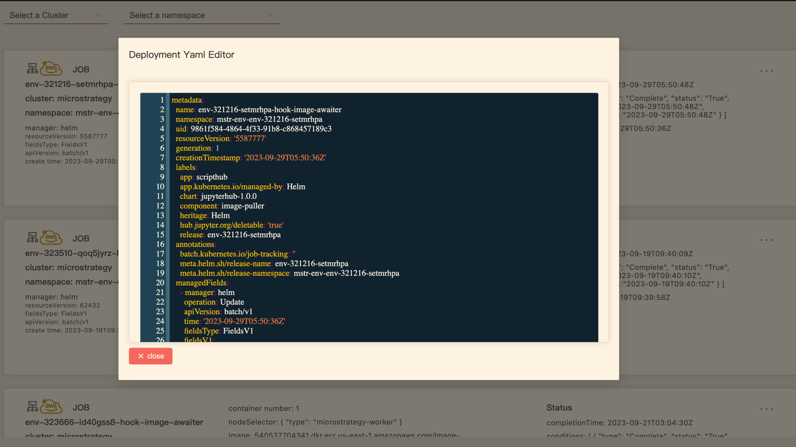
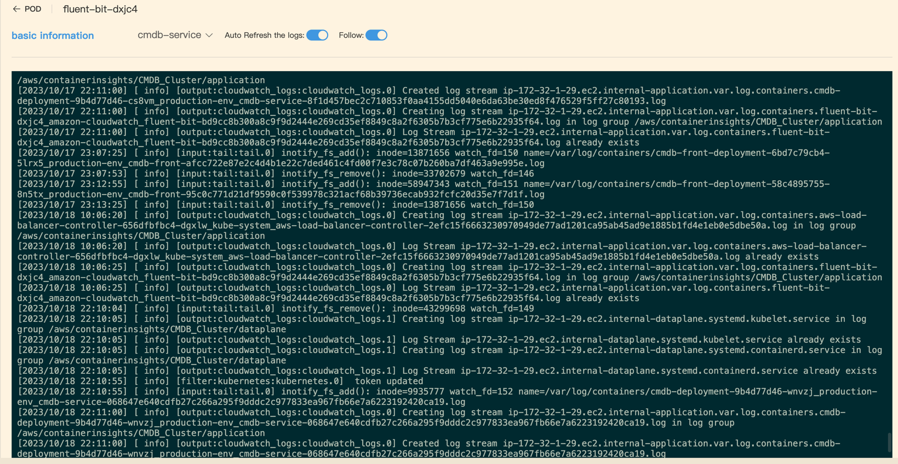
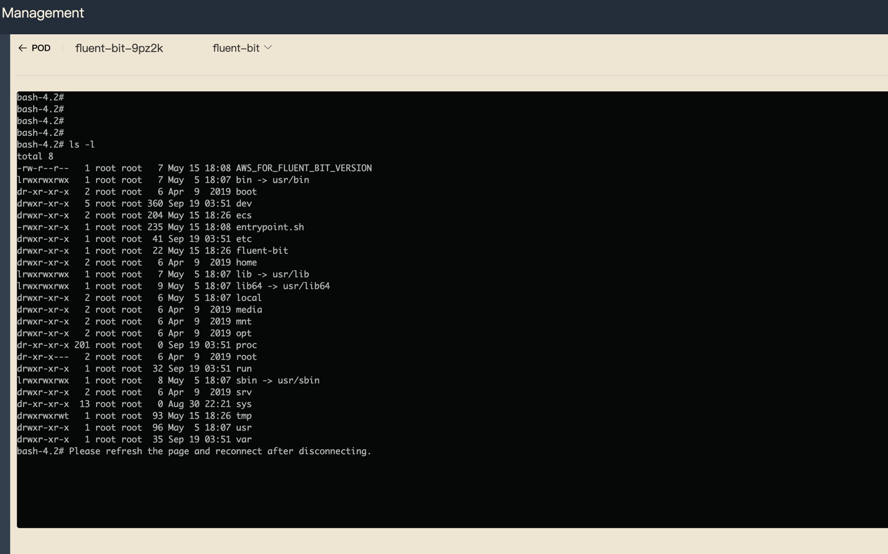

# vue3-k8s-dashboard-webssh

## Description
k8s dashboard management, for namespace, jobs, deployments and pods management

project for devops.

project include the web-frontend k8s cluster management pages building

## Details:
### Deployment:


### Yaml Editor:


### Pod log info:


### Container web terminal:



### installation:
```shell
npm install
```
### run:
```shell
npm run dev
```
### build:
```shell
npm run build
```